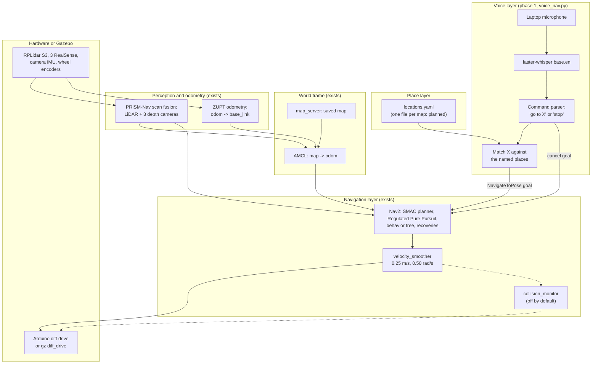
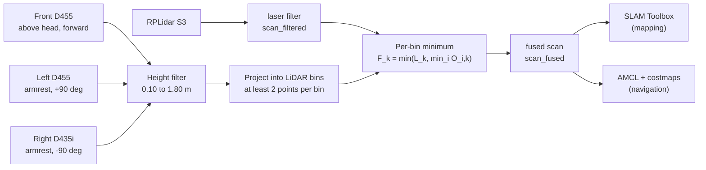
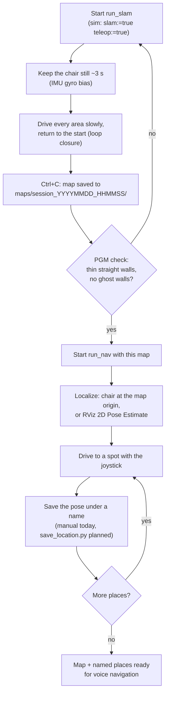
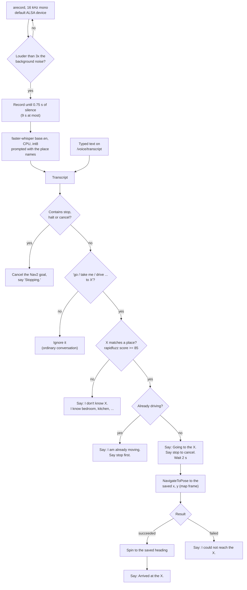
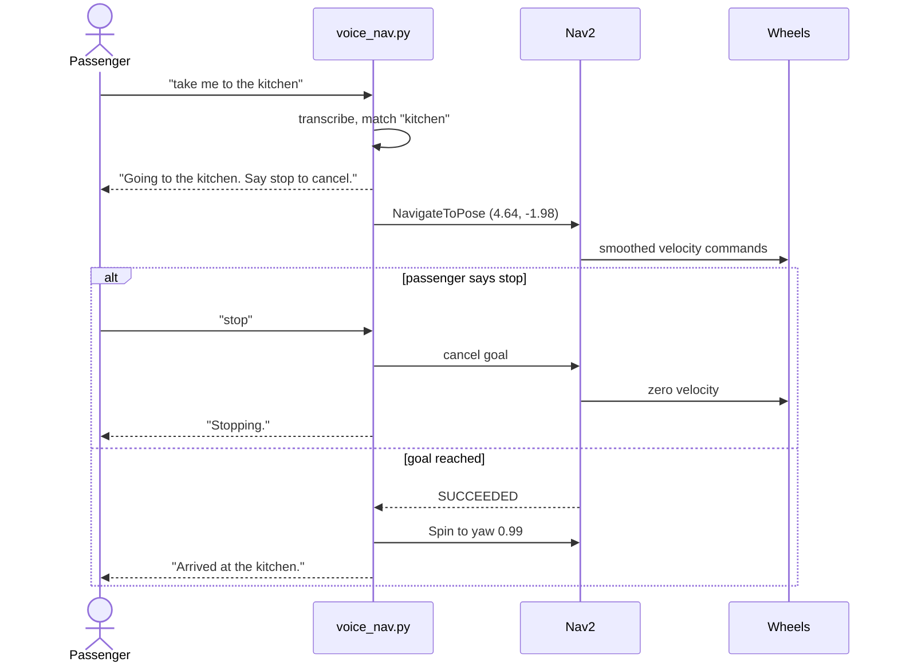
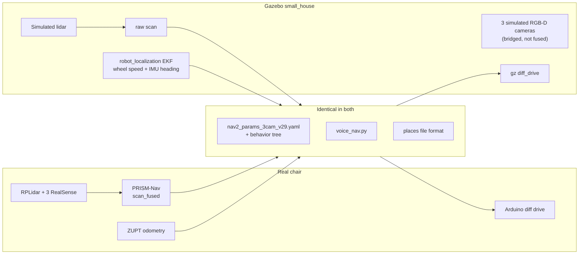
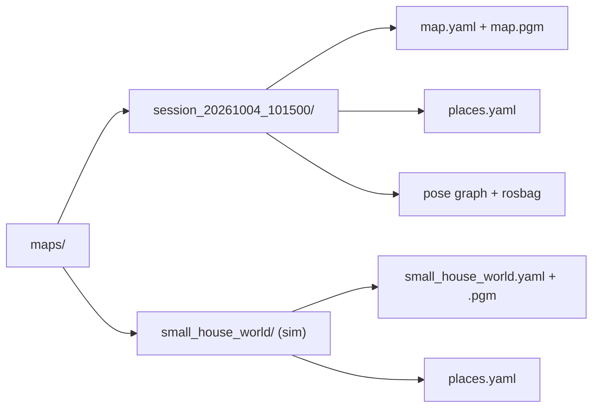
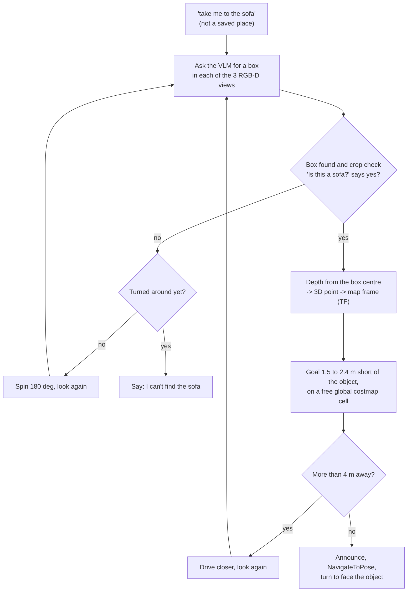

# Architecture: voice navigation on a saved map

Phase 1 lets the passenger say "take me to the kitchen" and have the chair drive there on a map that was built earlier by driving the chair manually. The laptop transcribes the command, matches it against the named places saved for that map, and sends the place to Nav2 as a goal. In the Gazebo house simulation this works end to end with typed commands: three named places reached, an unknown place refused, and "stop" cancelling a trip. The microphone path has not been tested yet, and nothing in this document has run on the real chair.

Nav2 is the only component that moves the wheels. The voice layer picks a destination and can cancel it, but it never publishes a velocity command. The joystick and the hardware emergency stop work independently of all of it.

| Phase | Scope | State (2026-10-04) |
|---|---|---|
| 1 | Voice to named places on a preloaded map, on the laptop, simulation first | `voice_nav.py` built; simulation tested with typed text; microphone and real chair not tested |
| 2 | Camera and VLM: go to an object the three RGB-D cameras can see | Prototype parked (`vlm_nav.py`, `vlm_server.sh`), not installed |
| 3 | Move the stack from the laptop to a Jetson Orin Nano Super | Not started |

## 1. What exists

| Piece | Where | State |
|---|---|---|
| Manual mapping | `run_slam` (`wheelchair_slam_mapping.launch.py`) | Drive with the joystick; Ctrl+C saves `.pgm`, `.yaml` and a rosbag to `maps/session_*/` |
| Navigation on a saved map | `run_nav` (`wheelchair_fusion_nav.launch.py`) | map_server, AMCL on `/scan_fused`, Nav2, velocity smoother |
| Named places | `src/wheelchair_description/config/locations.yaml` | One file with three simulation places: bedroom, kitchen, living_room |
| Go to a place from the shell | `scripts/go_to_location.py` | Sends one `NavigateToPose` goal, exits 0 or 1 |
| Voice navigation | `scripts/voice_nav.py` | Phase 1 node, section 5 |
| Simulation | `gazebo_sim.launch.py nav2:=true map:=...` | The chair's Nav2 parameters plus `nav2_sim.yaml`; three RGB-D cameras on the RealSense topic names (`bridge_camera:=true`, off by default) |
| Simulation map | `scripts/world_to_map.py`, or `slam:=true teleop:=true` | Exact map from the world file, or one driven by hand |

## 2. System layers

Data flows up through the layers, and only the velocity command flows back down.



The collision monitor is off by default in both `run_nav` and the simulation launch (`use_collision_monitor:=false`), so the smoothed command goes straight to the wheels unless it is switched on.

## 3. Perception and odometry under the voice layer

A named place is a pose on the saved map. It only stays useful if the chair localizes on that map the same way on every run, and two existing parts of the stack provide that. The description below follows the project thesis.

**PRISM-Nav (Pre-SLAM Integrated Scan Merging for Navigation).** On a wheelchair the occupant's body blocks most sensor positions. Only three sightlines clear it: one above head height looking forward, and one at armrest height on each side. Depth cameras at those three points give up to 259° of height-aware coverage. Their depth is height-filtered, projected into the LiDAR's angular bins, and merged with the LiDAR scan by element-wise minimum, F_k = min(L_k, min_i O_i,k), before SLAM. In `scan_fusion_v9` the height window is 0.10 to 1.80 m and a bin needs at least two camera points. Because the merge happens before SLAM, the saved map, the costmaps and AMCL all work on one geometry, including tables and shelves above the LiDAR plane. In the thesis trials in a research laboratory and hospital corridors, PRISM-Nav completed 40 of 40 runs without a collision and reached 33 of 40 goals, against 20 collisions in 40 runs for the LiDAR-only baseline (Fisher's exact test, p ≈ 7.8 × 10⁻⁸).



For voice navigation this means the map a place is saved on already contains the elevated obstacles around it, so the planner routes around them and AMCL can use them as landmarks.

**ZUPT odometry.** The chair stands still most of the time. A stationarity detector that requires the encoders and the accelerometer to agree clamps the velocity states and recalibrates the gyroscope bias whenever the chair stops, which bounds the heading drift that would otherwise build up between trips. It publishes `odom -> base_link`, which SLAM, AMCL and the controller all depend on. Per the README, `zupt_node` runs during navigation and the six-state `robust_ekf_zupt_node` during mapping.

## 4. Workflow: build the map and mark places

The map is built once by driving the chair manually. Then the user drives to each spot that should become a destination and saves it under a name.



Saving a place is manual today: `ros2 topic echo --once /amcl_pose --field pose.pose`, compute `yaw = 2 * atan2(z, w)`, and add `name: {x, y, yaw}` to `locations.yaml`. Each spot needs about 1.3 m of clearance from furniture. Closer spots failed in the simulation with "Start occupied", because the chair's footprint plus the inflation radius covered the goal.

## 5. Phase 1: voice to a named place

`voice_nav.py` is one long-running ROS 2 node that does the whole chain, from microphone to Nav2 goal to spoken reply.



While the chair is speaking (with `spd-say`), the microphone thread throws audio away, so the chair does not react to its own words, such as "say stop to cancel".

The turn at the end exists because the chair's Nav2 configuration ignores the goal heading (`yaw_goal_tolerance: 6.28`). After arriving, the node asks the behavior server's Spin action to turn to the saved yaw when the error is above 0.3 rad. Spin checks for collisions and can refuse next to furniture; the chair then keeps the heading it arrived with.



The node's interfaces:

| Interface | Type | Direction | Use |
|---|---|---|---|
| `/voice/transcript` | `std_msgs/String` | subscribed | Typed commands for testing; the microphone path calls the same handler directly |
| `/voice/status` | `std_msgs/String` | published | Every sentence the chair speaks |
| `navigate_to_pose` | `nav2_msgs/action/NavigateToPose` | action client | Drive to the place |
| `spin` | `nav2_msgs/action/Spin` | action client | Turn to the saved heading |
| TF `map -> base_link` | transform | read | Current heading, for the turn |

Five rules keep this safe for a seated passenger, and all five are in the code:

1. **Closed vocabulary.** Only names in the places file can become goals. Free text never becomes coordinates.
2. **Announce before moving.** The chair says where it is going and waits 2 s, during which "stop" cancels the trip.
3. **Stop has its own path.** It is matched by keyword on the raw transcript, before and independent of the place matcher, and cancels the active goal at any point in the trip.
4. **One goal at a time.** A new destination during a trip is refused until the passenger says stop.
5. **Nav2 drives.** The node only sends and cancels goals.

`docs/examples/vlm_intent.example.json` sketches a JSON contract for a later split into separate intent and navigation nodes. Phase 1 does not use it.

### Running it in the simulation

One-time setup of the Python environment. `--system-site-packages` keeps ROS 2's `rclpy` visible inside it, and the first run downloads the whisper `base.en` model from Hugging Face.

```bash
cd ~/wheelchair_nav
/usr/bin/python3 -m venv --system-site-packages .venv-voice
.venv-voice/bin/pip install faster-whisper rapidfuzz
```

Every simulation terminal needs `source setup.bash --skip` and `export FASTRTPS_DEFAULT_PROFILES_FILE=$HOME/fastdds_udp.xml` (see `AUTONOMOUS_NAV.md`, section 1). Then:

```bash
# terminal 1: Gazebo + Nav2 on the saved house map
ros2 launch wheelchair_description gazebo_sim.launch.py \
  world_name:=small_house use_rviz:=false nav2:=true \
  map:=$HOME/wheelchair_nav/maps/small_house_world.yaml

# terminal 2: publish the start pose (AUTONOMOUS_NAV.md, section 2.2), then
source .venv-voice/bin/activate
ros2 run wheelchair_description voice_nav.py

# speak, or type a command from a third terminal
ros2 topic pub --once /voice/transcript std_msgs/msg/String "{data: 'take me to the kitchen'}"
```

## 6. Simulation results

Tested on 2026-10-04 in the `small_house` world on `maps/small_house_world.yaml`, with commands typed to `/voice/transcript`. "Error" is the distance between where AMCL placed the chair and where Gazebo actually had it.

| Command | Expected | Result |
|---|---|---|
| "take me to the bedroom" | Drive to the bedroom | Arrived, error 0.06 m. The turn to the saved heading was refused by Nav2 ("Collision Ahead") next to furniture |
| "take me to the kitchen" | Drive to the kitchen | Arrived and turned to the saved heading (1.04 rad, saved 0.99), error 0.34 m |
| "please take me to the living room" | Drive to the living room | Arrived, error 0.30 m |
| "go to the garage" | Refuse | "I don't know garage. I know bedroom, kitchen, living room." |
| "stop" during a trip | Cancel | Goal cancelled, "Stopping." |
| A new place during a trip | Refuse | "I am already moving. Say stop first." |

Before these runs, AMCL ended up more than 1 m from the true position after a few trips, once with its heading more than 130° off. The cause was in the simulation's odometry: Gazebo's wheel odometry drifted about 45° in heading over one trip (castor slip), and the simulation EKF fused the wheels' x and y position, so the position error grew with every turn. The fix, in `gazebo_sim.launch.py` only, makes the simulation EKF take forward speed from the wheels and heading from the IMU. The real chair's configuration is unchanged. The 7 percent distance scale error in the simulated odometry, noted in `AUTONOMOUS_NAV.md`, was not re-measured.

## 7. Simulation parity

The simulation runs the same navigation chain with a few substitutions, so the voice workflow can be tested without hardware.



Differences that matter:

- **Time.** The simulation runs on simulated time.
- **Scan.** AMCL and the costmaps read the raw `/scan`, because PRISM-Nav fusion does not run in the simulation. The three simulated cameras now publish on the RealSense topic names, so fusion could be added to the simulation later, but phase 1 does not use them.
- **Odometry.** The simulation uses the `robot_localization` EKF described in section 6, while the chair uses ZUPT odometry.
- **Parameters.** `nav2_sim.yaml` is layered over the chair's Nav2 parameters, including a 0.65 m inflation radius.
- **Start pose.** The chair spawns at the world origin, so AMCL needs one `/initialpose` message before the first goal.

## 8. Per-map places (planned)

Places only make sense on the map they were recorded on. Today `voice_nav.py` and `go_to_location.py` read the single `locations.yaml`, so switching maps without switching that file would send the chair to the wrong spots. The plan is to keep the places next to their map:



The node would find the file from the map that is actually loaded, by reading the `yaml_filename` parameter of `/map_server`, so a place list can never be applied to the wrong map. A `--places <file>` override stays available for tests. `docs/examples/places.example.yaml` shows the format.

## 9. Next steps for phase 1

Each step can be checked in the simulation before it goes near the chair.

1. **Microphone test on the laptop.** Run `voice_nav.py` with the simulation and speak the six commands from section 6. Check: the same results as typed. If it misses words or reacts to background noise, tune the energy gate (three times the noise floor, minimum 0.01).
2. **`save_location.py <name>`.** Read one `/amcl_pose` message, convert the quaternion to yaw, append the entry to the active map's places file, and warn when the pose is inside the inflated costmap. Check: save a place in the simulation and reach it by voice.
3. **Per-map places** as in section 8. Check: two maps with different places, each answering with its own list.
4. **Start pose from the map.** Save a `home` place when mapping starts and publish it to `/initialpose` when `run_nav` starts, which removes the manual RViz step. Check: restart the simulation and confirm AMCL converges without RViz.
5. **Localization guard.** Refuse a goal while the AMCL covariance is above a threshold. Check: publish a wrong start pose and confirm the chair says so instead of driving.
6. **Real chair.** Build a map with `run_slam`, mark places, then run `run_nav` and `voice_nav.py`. Run the first trips with an empty chair, in open space, with a hand on the emergency stop.

## 10. Software and models

| Role | Phase 1 (in use) | Option if needed |
|---|---|---|
| Robot software | ROS 2 Jazzy, Nav2, SLAM Toolbox, AMCL | |
| Simulation | Gazebo (`gz sim` 8) with `ros_gz_bridge` | |
| Audio capture | `arecord`, 16 kHz mono, default ALSA device (laptop microphone) | USB headset or close-talk microphone |
| Speech detection | Energy gate in `voice_nav.py` for start and end; faster-whisper's built-in Silero VAD trims silence | Silero VAD for start and end too, for noisy rooms |
| Wake word | None; only "go to ..." and "stop" phrases do anything | openWakeWord or a push-to-talk button if it triggers falsely |
| Speech to text | faster-whisper `base.en`, int8 on the CPU, prompted with the place names | `small.en`; CUDA on the Jetson |
| Command matching | Regular expressions plus `rapidfuzz` (score at least 85) | A small LLM (for example Qwen2.5 1.5B with a JSON grammar) if phrasing varies too much |
| Text to speech | `spd-say` (speech-dispatcher, preinstalled on Ubuntu) | Piper |
| Python environment | `.venv-voice`, created with `--system-site-packages` | |
| VLM (phase 2) | Qwen2.5-VL 3B, served by the llama.cpp server bundled with Ollama, on the GPU | |

The laptop has an RTX 4050 Laptop GPU with 6 GB, 14 GB of RAM and a Ryzen 7 7445HS. With Gazebo and Nav2 running, RAM was the tight resource (about 11 GB in use, with swap active). Phase 1 runs speech to text on the CPU and leaves the GPU free.

## 11. Phase 2: camera and VLM (parked)

Phase 2 adds one more kind of destination: an object the chair can see. "Take me to the sofa" works even when no place called sofa was saved. The prototype is kept in `scripts/vlm_nav.py` with `scripts/vlm_server.sh`; neither is installed or launched.



Findings from one simulation session on 2026-10-04:

- **Speed.** Ollama ran the VLM's image encoder on the CPU with at least 1024 image tokens, which took about 60 s per frame. Running the llama.cpp server that ships with Ollama, with the encoder on the GPU and 64 to 512 image tokens (`vlm_server.sh`), brought it to 0.3 to 0.6 s per frame after a 22 s first call.
- **"go to the sofa".** The crop check rejected two wrong boxes, the right camera found the sofa 3.0 m away, and the chair drove there.
- **"go to the refrigerator".** The crop check accepted a wrong object at (0.64, -3.45); the real refrigerator is at (8.70, -1.03). The 3B model's yes or no answer is not a reliable filter on its own.
- **Localization.** The AMCL drift described in section 6, since fixed for the simulation, made object positions unreliable during that session.

Decisions already made for phase 2: the front camera faces forward over the passenger, the simulated cameras publish on the RealSense topic names, and the side cameras will need color. On the chair the side cameras are depth only today (`enable_color: false` in `multi_camera.launch.py`), so turning color on costs USB bandwidth. Still open: how to reject wrong objects. The candidates are a stricter check that shows the box in the full image, an open-vocabulary detector such as YOLO-World with the VLM only confirming, or a larger VLM.

The phase 1 rules carry over: the VLM only proposes a target, the chair announces it before moving, "stop" always works, and Nav2 does the driving.

## 12. Phase 3: Jetson Orin Nano Super

The Jetson Orin Nano Super has 8 GB of memory shared by the CPU and GPU, and Nav2, the three RealSense streams and PRISM-Nav fusion already use a large part of it. Phase 1 needs only whisper `base.en` and the node itself; the phase 2 VLM should load only when a command needs it and unload afterwards. Before choosing model sizes, measure free memory with Nav2 and all three cameras running. Today the model name and device are constants in `voice_nav.py`; a small per-platform config file is the planned change for this move.

Open question: ROS 2 Jazzy targets Ubuntu 24.04, and the JetPack release for the Orin Nano may ship a different Ubuntu version. If they differ, run the ROS stack in a Jazzy container on the Jetson.

## 13. Physical markers (optional)

The named places are virtual markers and need no hardware. If AMCL loses the chair in practice, for example after a restart away from the map origin, fixed visual tags (AprilTag or ArUco) at a few known spots could reset its pose when a camera sees them. That costs a detector node and a calibration step from tag to map, so it is only worth adding if localization fails in real use.

## 14. Risks and open questions

- **Microphone not tested.** A laptop microphone on a moving chair picks up motor and room noise, and the energy gate is basic. A headset may be needed.
- **Real chair not re-tested.** `run_slam`, `run_nav` and `voice_nav.py` have not run on the chair as part of this work.
- **Collision monitor off by default** in `run_nav` and in the simulation. Decide whether voice trials on the chair run with `use_collision_monitor:=true`.
- **Build.** Commit `bab6a1a` added a copy of `wheelchair_description`'s `CMakeLists.txt` at the repository root. A plain `colcon build`, which is what `source setup.bash` runs, now treats the root as the only package (`colcon list` prints `wheelchair_description .`) and skips everything under `src/`; with an existing `build/` folder it fails with a CMake cache mismatch. `colcon build --base-paths src --symlink-install` builds correctly.
- **Clearance.** Places closer than about 1.3 m to furniture can fail with "Start occupied".
- **Final heading.** Nav2's Spin can refuse the turn to the saved heading next to furniture, as it did at the bedroom.
- **Odometry on the chair.** The simulation needed a 0.32 m axle to `base_link` shift in its odometry; whether the chair has the same offset is unchecked.
- **`run_nav` kills every ROS 2 process** at start (`pkill -9 -f ros2`), so it must not be launched while the simulation is running.
