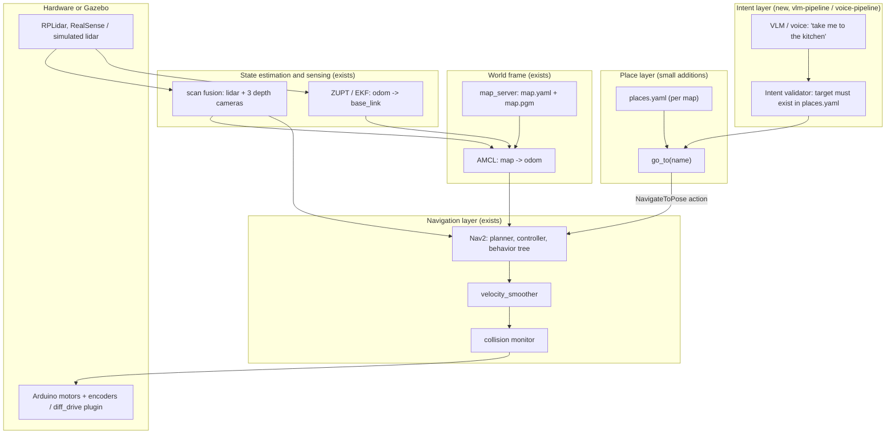
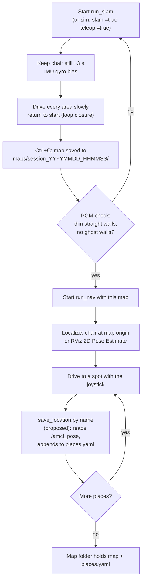
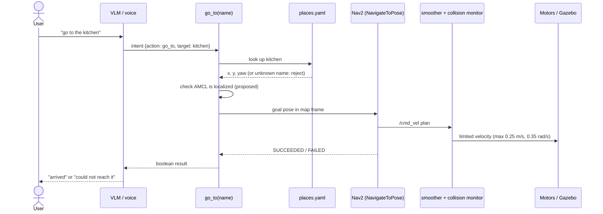
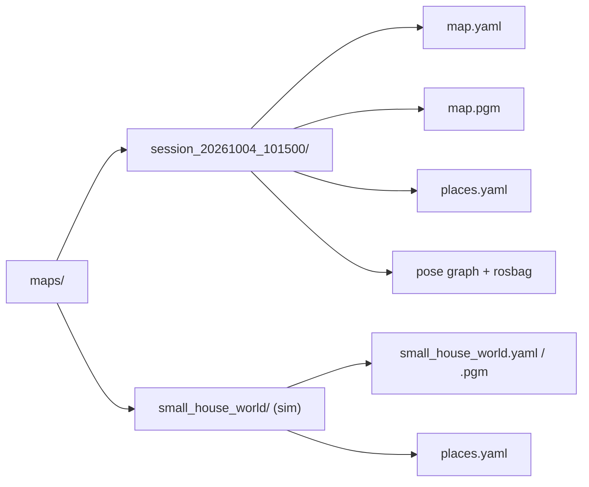
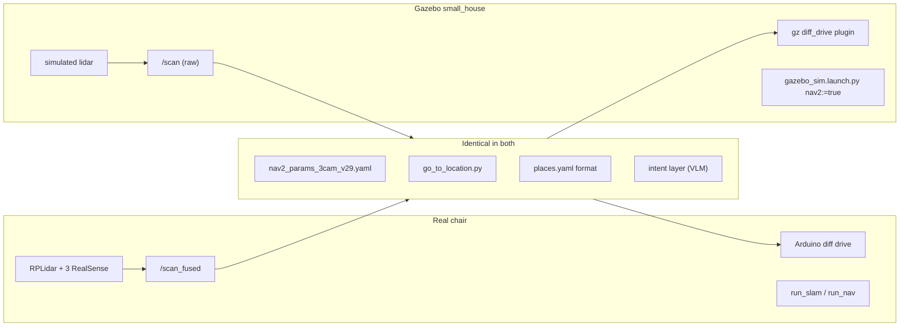
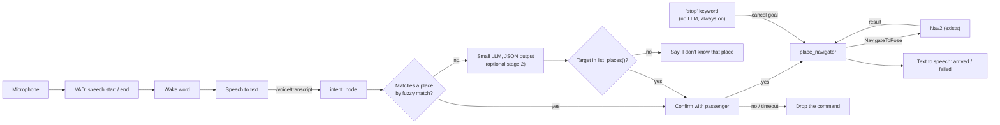
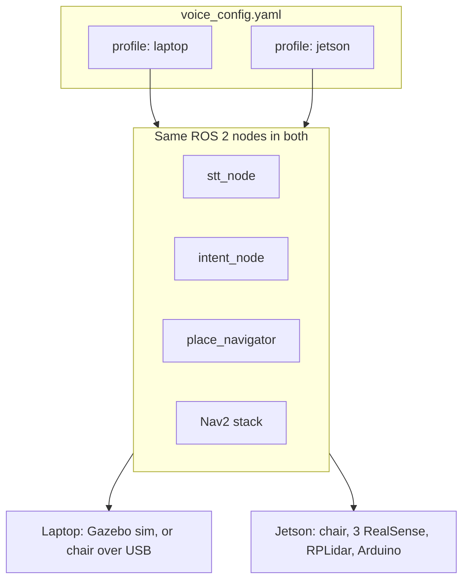
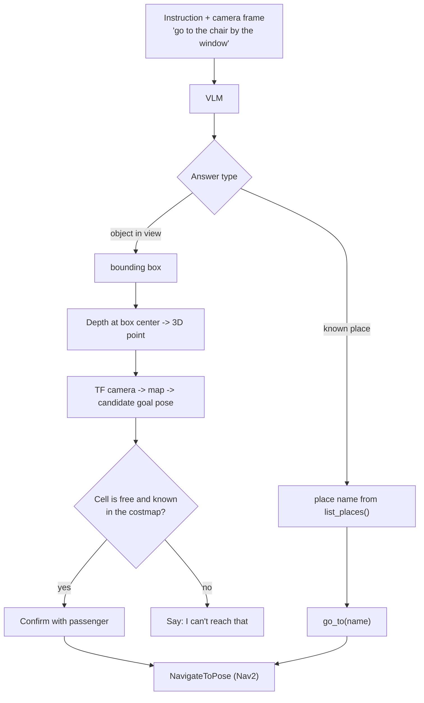

# Architecture: saved-map autonomous navigation with named places

The chair already maps, localizes on a saved map and drives to a named place, in simulation and on hardware. This document describes how those pieces fit together, what is still missing to make the workflow repeatable on a real chair, and where the VLM and voice layer plugs in. Nothing here changes the motor path: Nav2 and the safety layer remain the only components that command the wheels.

The proposal rests on one idea. A "marker" is a named pose (`x`, `y`, `yaw` in the map frame) stored next to the map it was recorded on. The user drives the chair to a spot once, saves it under a name, and later asks for it by name.

## 1. What exists today

All of this is in the repository now. The simulation figures come from `AUTONOMOUS_NAV.md`; the real-chair mapping and navigation launches have not been re-tested in this work.

| Piece | Where | State |
|---|---|---|
| Manual mapping on the chair | `run_slam` (`wheelchair_slam_mapping.launch.py`) | Drive with the joystick, Ctrl+C saves `.pgm`, `.yaml` and a rosbag to `maps/session_*/` |
| Navigation on a saved map | `run_nav` (`wheelchair_fusion_nav.launch.py`) | map_server, AMCL, Nav2, velocity smoother, collision monitor |
| Named places | `src/wheelchair_description/config/locations.yaml` | One global file with three sim places |
| Go to a place | `scripts/go_to_location.py` (`go_to(name)`) | Sends a `NavigateToPose` goal, returns success as a boolean |
| Simulation | `gazebo_sim.launch.py nav2:=true map:=...` | Same Nav2 parameters as the real chair, plus `nav2_sim.yaml` overlay |
| Sim map | `scripts/world_to_map.py` or `slam:=true teleop:=true` | Exact map from the world file, or a map driven by hand |

## 2. System layers

Data flows up through the layers. Only the velocity command flows back down.

The only link from the intent layer to the wheels goes through `go_to(name)` and the Nav2 action. The VLM never publishes `/cmd_vel`.

## 3. Workflow: build the map and mark places

Mapping is manual, as requested. The chair is driven once, the map is saved, then the user drives to each spot and saves it as a named place.

Today steps H to I are manual: read `/amcl_pose`, compute `yaw = 2 * atan2(z, w)`, edit `locations.yaml`. `save_location.py` automates exactly that, and nothing more.

## 4. Workflow: go to a place

A rejected name, a lost localization or a failed goal all return `False`. The chair stops where Nav2 leaves it; the intent layer only reports the result.

## 5. Per-map layout

Places only make sense on the map they were recorded on, so they live in the same folder as that map. This replaces the single global `locations.yaml`.

`go_to` should find the file from the map that is actually loaded, so a place list can never be applied to the wrong map. Reading the `yaml_filename` parameter of the `/map_server` node gives that path without a new argument. A `--places <file>` override stays available for tests. See `docs/examples/places.example.yaml` for the file format.

## 6. Simulation parity

The simulation runs the same chain with a few substitutions, so the whole workflow above can be tested without hardware.

Differences that matter: the sim uses simulated time, feeds the raw `/scan` to AMCL and the costmaps in place of `/scan_fused`, and layers `nav2_sim.yaml` over the real parameters. It spawns the chair at the world origin, so AMCL needs one `/initialpose` message before the first goal. Simulation odometry is about 7 percent off in scale and has not been calibrated, so sim travel times do not predict real ones.

## 7. What to build

Six additions, in this order. Steps 1 to 4 are small and independent; steps 5 and 6 are the voice layer from section 10. All are testable on the sim.

1. **`save_location.py <name>`** reads one `/amcl_pose` message, converts the quaternion to yaw and appends the entry to the active map's `places.yaml`. Check: save a place in the sim, restart `go_to_location.py` on it, confirm `SUCCEEDED`.
2. **Per-map places in `go_to_location.py`.** Resolve the places file from the loaded map, with `--places` as an override, and add `--list`. Check: run the same command against two maps with different places and confirm each list differs.
3. **Initial pose from the map.** Save a `home` place when mapping starts (the origin) and publish it to `/initialpose` after `run_nav` starts. This removes the manual RViz step. Check: restart the sim, confirm AMCL converges without RViz.
4. **Localization guard in `go_to`.** Refuse to send a goal while the AMCL covariance is above a threshold. Check: publish a bad initial pose in the sim and confirm the goal is refused instead of attempted.

5. **Voice nodes** (`stt_node`, `intent_node`, `place_navigator`) as described in section 10. Check: publish typed text to `/voice/transcript` in the sim and confirm the chair arrives, with no microphone involved. Add the microphone only after that works.
6. **Stop path.** A "stop" utterance, handled without the LLM, cancels the active Nav2 goal. Check: say or publish "stop" mid-trip in the sim and confirm the chair halts.

The intent layer on this branch then needs only `list_places()` (to give the VLM its vocabulary) and `go_to(name)`. The JSON contract is in `docs/examples/vlm_intent.example.json`.

## 8. Physical markers (optional, later)

The named poses above are virtual markers, and they need no hardware. If the chair drifts or restarts away from the origin, fixed visual tags (AprilTag or ArUco) at a few known spots could reset AMCL's pose when seen by a RealSense camera. This costs a detector node and a tag-to-map calibration step, so it is only worth adding if AMCL loses the chair in practice. Nothing in the first four steps depends on it.

## 9. Risks and open questions

- **Real chair, not re-tested.** `run_slam` and `run_nav` were not run in the simulation work. Step 1 should be proven on the chair before the VLM layer relies on it.
- **Odometry offset.** The sim needed a 0.32 m axle-to-`base_link` shift in its odometry. The real chair may have the same offset; this is unchecked.
- **Clearance.** Places closer than about 1.3 m to furniture failed with "Start occupied" in the sim, because the 0.9 x 0.7 m footprint plus inflation covered the goal. `save_location.py` should warn when the saved pose is inside the inflated costmap.
- **`go_to` uses a new node per call** and expects `rclpy.init()` first. The Python import path from the VLM process is untested; wrap it in a small ROS node or service if the VLM runs in a separate process.
- **`run_nav` kills all ROS 2 processes** at start (`pkill -9 -f ros2`). It must not be launched while the simulation is running.

## 10. Voice-driven navigation

A spoken command becomes a place name, and the place name goes through the same `go_to(name)` path as everything else. The voice layer adds three ROS 2 nodes and no new way to move the chair.

The nodes and their interfaces:

| Node | Input | Output | Notes |
|---|---|---|---|
| `stt_node` | Microphone audio | `/voice/transcript` (`std_msgs/String`) | Starts only after the wake word; VAD ends the utterance |
| `intent_node` | `/voice/transcript`, places list | `/voice/intent` (JSON string, format in `docs/examples/vlm_intent.example.json`) | Fuzzy match first; the LLM runs only when that fails |
| `place_navigator` | `/voice/intent`, `places.yaml` | `NavigateToPose` goal, `/voice/status` text for TTS | One long-lived node that wraps `go_to`; replaces creating a node per call |

Four rules keep this safe for a seated passenger:

1. **Closed vocabulary.** The intent must name a key in `places.yaml`. Free text never becomes coordinates.
2. **Confirmation before motion.** The chair says "Going to the kitchen, say stop to cancel" and waits a few seconds before it moves.
3. **Stop has its own path.** The stop keyword is matched on the raw transcript or a dedicated keyword spotter, never on the LLM output, and cancels the Nav2 goal. The joystick and the hardware emergency stop stay independent of all of this.
4. **Typed input is a first-class source.** `/voice/transcript` accepts text from any publisher, so the whole chain runs in the simulation with no audio.

## 11. Models and software

These are proposals for each role, chosen to run on the laptop now and on the Jetson later. None has been benchmarked on this project; the benchmark gates in section 12 decide what ships.

| Role | Proposed choice | Why | Fallback |
|---|---|---|---|
| Robot framework | ROS 2 Jazzy, Nav2, SLAM Toolbox, AMCL | Already in use | None |
| Simulation | Gazebo (`gz sim`) with `ros_gz` bridges | Already in use | None |
| Voice activity detection | Silero VAD | Small, runs on CPU | WebRTC VAD |
| Wake word | openWakeWord | Open source, runs on CPU, trainable for a custom phrase | Push-to-talk button |
| Speech to text | faster-whisper, `small.en` | Good accuracy on short commands, CUDA and CPU backends | `base.en`; whisper.cpp if the Jetson build is easier |
| Stage 1 intent | `rapidfuzz` match against place names plus a few verb patterns ("go to", "take me to") | No model, no latency, deterministic | None needed |
| Stage 2 intent (optional) | Qwen2.5 1.5B Instruct, 4-bit GGUF, run with `llama.cpp` and a JSON grammar | Handles free phrasing; the grammar forces valid JSON | A 3B model if 1.5B misses too many phrasings |
| Text to speech | Piper | Offline, fast on CPU | `espeak-ng` |
| Audio capture | USB microphone or headset, `sounddevice` | Close-talk mic is far more reliable than a laptop mic in a moving chair | USB array microphone |
| Glue | Python `rclpy` nodes, one `voice_config.yaml` | Matches the existing launch style | None |
| VLM (section 13, later) | Qwen2.5-VL 3B Instruct, or SmolVLM2 / moondream2 if memory is tight | Small enough for 8 GB shared memory | A detector plus depth (YOLO-World or Grounding DINO) if VLM boxes are unreliable |

## 12. Compute: laptop now, Jetson Orin Nano Super later

Everything runs on the laptop first. Moving to the Jetson then means changing a config profile, not code.

A profile sets the model name, the backend (CUDA or CPU), the quantization and whether the LLM stage is on. The nodes read nothing else about the platform.

The Jetson Orin Nano Super has 8 GB of memory shared by CPU and GPU, and Nav2, the three RealSense streams and scan fusion already use a large part of it. Rough, unmeasured planning figures: `small.en` speech to text about 1 GB, a 1.5B 4-bit LLM about 1 to 1.5 GB, a 3B 4-bit VLM about 2 to 3 GB. The plan that follows from this:

1. Keep the VLM unloaded until it is asked for, and unload it afterwards.
2. Run the LLM stage only when the fuzzy match fails.
3. Measure free memory with Nav2 and all cameras running before choosing model sizes.

Benchmark gates before the Jetson move, with targets to be agreed: speech to text latency for a 3 second command, time from end of speech to the first motion command, peak memory with the full stack up, and the `go_to` success rate over a fixed list of spoken phrases.

Open question: ROS 2 Jazzy targets Ubuntu 24.04, and the JetPack release available for the Orin Nano may ship a different Ubuntu version. Check this first. If they differ, run the ROS stack in a Jazzy container on the Jetson.

## 13. One-shot VLM with the camera (later, not in scope now)

The VLM extends the same pipeline with one extra source of intent: the camera frame. It is written down here so the earlier layers leave room for it, and nothing in sections 1 to 12 depends on it.

The rules from section 10 carry over. The VLM only proposes a target; it does not command motion. A target must be a known place or a free, mapped cell within a maximum distance, and the passenger confirms before the chair moves. The first VLM milestone is the simpler half: asking the VLM to pick a known place from the current view, which reuses `go_to(name)` unchanged. The object-to-goal half needs the camera extrinsics in TF and is the larger piece of work.
